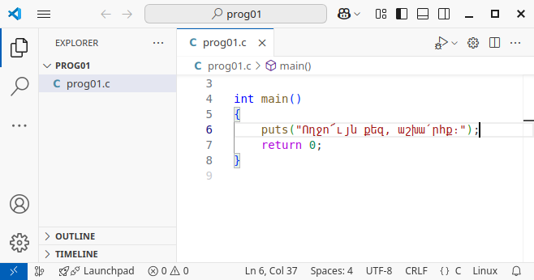

# Առաջին ծրագիրը

> Սի լեզվով գրված առաջին ծրագիրը, դրա խմբագրումը, թարգմանումը և կատարումը։

_Ծրագրավորել_ կամ _ծրագիր գրել_ նշանակում է ստիպել, համոզել, խնդրել կամ
հրամայել էլեկտրոնային հաշվիչ մեքենային, որ այն ինչ-որ օգտակար գործ
կատարի։ Այդ ստիպելու, համոզելու, խնդրելու կամ հրամայելու
բովանդակությունը մեքենային պետք է փոխանցվի մի որեւէ լեզվով՝
_ծրագրավորման լեզվով_։ Մեր գրքում այդ լեզուն C-ն է, որի համար
կօգտագործենք նաև հայերեն _Սի_ անունը։ Ու մեր առաջին խնդրանքն էլ թող
լինի, մեր նախնիներից եկած ավանդությամբ, լույս աշխարհքին ողջունելը։ Գրենք
ծրագիր, որի կատարումը պետք է արտածի «Ողջո՜ւյն քեզ, աշխա՛րհք։» տեքստը։ Դա
մի փոքրիկ ծրագիր կլինի, բայց, ինչպես կտեսնենք ստորեւ, դրա տողացի
վերլուծությունը մեզ համար կբացահայտի ծրագրի կյանքի շատ կարեւոր մի քանի
հատկություններ։

Այսպիսով, մի որեւէ տեքստային խմբագրիչով ստեղծենք ֆայլն ու դրանում
գրառենք հետևյալ տեքստը.

```c
/_ Առաջին ծրագիրը _/
#include <stdio.h>

int main()
{
    puts("Ողջո՜ւյն քեզ, աշխա՛րհք։");
    return 0;
}
```

Առաջին տողում գրված նիշերով սկսվող և նիշերով ավարտվող տեքստը
_մեկնաբանություն_ է։ Մեկնաբանությունները նախատեսված են մարդկանց համար.
դրանք ամբողջությամբ անտեսվում են կոմպիլյատորի կողմից։ Սի լեզվում
մեկնաբանություններ կարելի է գրել նաև C++ լեզվից փոխանցված եղանակով.
այդպիսի մեկնաբանությունները սկսվում են նիշերով և տարածվում են մինչև տողի
վերջը։

Երկրորդ տողի արտահայտությունը պահանջում է կոմպիլյացիայից առաջ ֆայլին
կցել գրադարանային ֆայլը։ Վերջինս պարունակում է տվյալների ներմուծման ու
արտածման համար նախատեսված ստանդարտ ֆունկցիաների, կառուցվածքների և այլ
ծրագրային տարրերի հայտարարությունները։ Այստեղ առաջ անցնելով նշենք, որ
նիշով սկսվող բոլոր հրահանգները նախատեսված են _նախապրոցեսորի_
(_preprocessor_) համար, և Սի լեզվի մաս չեն կազմում (տե՛ս Զրույց ??)։

Չորրորդ տողում գրված է Սի ծրագրերի _մուտքի կետ_՝ կատարման սկիզբ,
հանդիսացող ֆունկցիայի վերնագիրը։ Տվյալ դեպքում ֆունկցիան արգումենտներ չի
սպասում՝ նրա արգումենտների ցուցակը դատարկ է, բայց վերադարձնում է
(integer, ամբողջ թիվ) տիպի արժեք։ Սի լեզվով գրված բոլոր ծրագրերն իրենց
աշխատանքը սկսում են հենց ֆունկցիայից։ Ավելի պատկերավոր ասած՝ ֆունկցիան
կանչվում է օպերացիոն համակարգի կողմից, իսկ նրա վերադարձրած արժեքը
օպերացիոն համակարգը մեկնաբանում է որպես կատարվող ծրագրի հաջող կամ
անհաջող ավարտի հայտանիշ։ Պայմանավորվածություն կա, որ արժեք են
վերադարձնում հաջող ավարտված ծրագրերը, իսկ զրոյից տարբեր արժեք՝ անհաջող
ավարտվածները։

Սի ֆունկցիայի _մարմինը_՝ այն հրամանների հաջորդականությունը, որոնցով
որոշվում է ֆունկցիայի վարքը, պարփակված է ֆունկցիայի վերնագրին հաջորդող և
փակագծերի մեջ։ Մեր օրինակի հինգերորդ տողում սկսվում է և ութերորդ տողում
ավարտվում է ֆունկցիայի մարմինը։

Վեցերորդ տողում օգտագործված է (standard input-output) գրադարանի (put
string -- արտածել տողը) ֆունկցիան։ Այն իր արգումենտում ստանում է նիշերի
տող և այդ տողն արտածում է արտածման ստանդարտ հոսքին։

Յոթերորդ տողում օգտագործված հրամանը նախատեսված է ֆունկցիայից արժեք
վերադարձնելու համար (սրա մասին դեռ շատ կխոսենք)։ Այստեղ հրամանով
ֆունկցիան վերադարձնում է $0$ արժեքը, որը, ինչպես արդեն նշեցինք, ցուց է
տալու ծրագրի՝ այդ կետում հաջող ավարտված լինելը։

Վերջապես նկատենք մի կարևոր բան եւս. բոլոր հրամաններն ավարտվում են `;`
(կետ-ստորակետ) նիշով։

Հիմա փորձենք «կյանք տալ» այս ծրագրին. այսինքն՝ _կատարել_ այն։ Դրա համար
տեսնենք թե ինչ կյանք է ապրում ծրագիրը՝ տեքստի պատրաստումից մինչև
կատարում։

Ժամանակակից ծրագրավորողը Սի լեզվով (կամ դրան նման մի այլ լեզվով)
քոմփյութերային ծրագրերի մշակման ընթացքում կատարում է, կրկնում է հետևյալ
հիմնական քայլերը.

__Ծրագրի տեքստի խմբագրում__ (editing) --- մի որևէ տեքստային խմբագրիչով,
կամ ծրագրերի մշակման ինտեգրացված միջավայրում (IDE, integrated
development environment) ստեղծվում է ծրագրի տեքստը և պահպանվում է ֆայլի
մեջ։ Սի լեզվով գրված ծրագրերի ֆայլերը հիմնականում ունենում են
վերջավորություն, իսկ հայտարարությունների ֆայլերը՝ վերջավորություն։

Մեր դեպքում, օրինակ, ծրագրի ֆայլը ստեղծելու համար ընտրել ենք Visual
Studio Code տեքստային խմբագրիչը, ստեղծել ենք ֆայլը ու դրանում գրել ենք
վերը բերված ծրագրի տեքստը.



__Թարգմանություն__ կամ __կոմպիլյացիա__ (compilation) --- ծրագրավորողի
գրած ձեռագիրը թարգմանող ծրագրի՝ _կոմպիլյատորի_ միջոցով փոխակերպվում է
կոնկտրետ սարքակազմի վրա և կոնկրետ օպերացիոն համակարգում աշխատող
_կատարվող մոդուլի_ (executable module)։

Դիցուք մեր համակարգում Սի լեզվի կոմպիլյատորը հասանելի է անունով։ Ծրագրի
ֆայլը (ձեռագիրը, source file) թարգմանում ենք հրամանային տողում
ներմուծելով հետռյալ հրամանը.

```bash
$ cc prog01.c -o prog01
```

Այս հրամանում կոմպիլյատորին տրվող պարամետրի արգումենտով որոշվում է
ստեղծվելիք կատարվող մոդուլի անունը։ պարամետրի բացակայության դեպքում
կոմպիլյատորը կստեղծի անունով կատարվող ֆայլ։ Եթե ծրագրի տեքստը սխալներ չի
պարունակում, և թարգմանությունը հաջող է անցնում, ապա ստեղծվում է կատարվող
մոդուլը։

__Թեսթավորում__ (testing) և __կատարում__ (execution) --- օպերացիոն
համակարգը կատարվող մոդուլը բեռնում է մեքենայի հիշողության մեջ և սկսում է
կատարել այն։ Ինչպես արդեն նշվեց վերեւում, կատարումը սկսվում է
ֆունկցիայից։ Թեսթավորման ժամանակ ծրագիրը կատարվում է նախապես որոշված
տվյալներով ու սցենարներով և դրա ստեղծած արդյունքները համեմատվում են
նախապես տրված արդյունքների հետ։ Կատարման ժամանակ ծրագիրը պարզապես
շահագործվում է ըստ իր նշանակության։

մոդուլն աշխատեցնելու համար պարզապես պետք է հրամանային տողից այն
գործարկել ինչպես որևէ այլ ծրագիր.

```bash
$ ./prog01
Ողջո՜ւյն քեզ, աշխա՛րհք։
```

Հիմա, եթե հրամանով արտածենք Bash-ի փսոևդոփոփոխականը, որը պարունակում է
վերջին աշխատած ծրագիր ավարտի կոդը, ապա կստանանք արժեքը։ Այս -ն հենց
ֆունկցիայից հրամանով վերադարձրած արժեքն է։

```bash
$ echo $?
0
```

Համոզվելու համար կարող ենք, օրինակ, ծրագրի տողը փոխարինել տողով, ապա
կատարելուց հետո նորից ստուգել -ի արժեքը։

```bash
$ cc prog01.c -o prog01
$ ./prog01
Ողջո՜ւյն քեզ, աշխա՛րհք։
$ echo $?
7
```

__Շտկում__ (debugging) --- եթե կոմպիլյացիայի, թեսթավորման կամ կատարման
քայլերում ծրագրում հայտնաբերվել են բառային (լեքսիկական), շարահյուսական
կամ տրամաբանական սխալներ, ապա շտկումներ են կատարվում ծրագրի տեքստում և
կոմպիլյացիայի, կատարման կամ թեսթավորման քայլերը նորից կրկնվում են
անհրաժեշտ հաջորդականությամբ։

Այս պարզագույն օրինակում, իհարկե, դժվար է ինչ-որ մի տեխնիկական, առավել
եւս՝ տրամաբանական սխալ անել։ Բայց ենթադրենք, թե մոռացել ենք 6-րդ տողն
ավարտող նիշը։ Թարգմանելիս կոմպիլյատորը կհայտնաբերի սխալը և կարտածի
համապատասխան հաղորդագրություն.

```plain
prog01.c: In function ‘main’:
prog01.c:6:36: error: expected ‘;’ before ‘return’
    6 |     puts("Ողջո՜ւյն քեզ, աշխա՛րհք։")
      |                                    ^
      |                                    ;
    7 |     return 0;
      |     ~~~~~~          
```

Այս հաղորդագրությունն ասում է, որ ֆայլի, ֆունկցիայում, 6-րդ տողի 36-րդ
դիրքում, բառից առաջ սպասվում է նիշը։

Սի լեզվի տարբեր իրականացումներում սխալի մասին հաղորդագրությունները կարող
են տարբեր լինել, սակայն դրան իմաստը միշտ նույնն է։ Օրինակ, մեր դեպքում
համակարգի հրամանը կապված է GNU GCC-ի կոմպիլյատորի հետ։ Եթե նույն ծրագիրը
թարգմանենք LLVM-ի կոմպիլյատորով, ապա կստանանք տեքստով տարբեր, բայց
իմաստով նման սխալի հաղորդագրություն.

```plain
$ clang prog01 -o prog01
prog01.c:6:56: error: expected ';' after expression
    6 |     puts("Ողջո՜ւյն քեզ, աշխա՛րհք։")
      |                                    ^
      |                                    ;
1 error generated.
```

Շատ կարեւոր է, որ ծրագրավորողը սովորություն դարձնի ուշադիր կարդալ ու
հասկանալ սխալների մասին հաղորդագրությունները. դա, իսկապես, ոչ պակաս
կարևոր է, քան ծրագրի տեքստը կարդալն ու հասկանալը։
