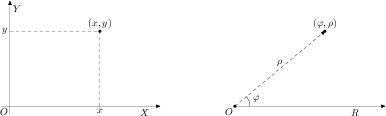

# Փոփոխականներ

> Փոփոխականների հայտարաումը եւ սահմանումը, փոփոխականի տիպը, 
փոփոխականին արժեքի վերագրումը, փոփոխականի հասցե, ներմուծման 
ստանդարտ հոսքից տվյալների կարդալը։

Սի լեզվով գրված ամեն մի ծրագիր, բացառությամբ պարզագույն դեպքերի,
օգտագործում է մեքենայի հիշողության մեջ տեղավորված ինչ-որ օբյեկտներ՝
թվեր, զանգվածներ, ստրուկտուրաներ, ֆայլերի որոշիչներ և այլն։ Այդ
օբյեկտների հետ աշխատանքը հեշտացնելու համար ծրագրավորման լեզուներում
առաջարկվում է _փոփոխականի_ գաղափարը։ Ճիշտ այնպես, ինչպես մեզ շրջապատող
առարկաների կամ մարդկանց հետ աշխատանքը հեշտանում է դրանց անուններն
օգտագործելիս։ Փոփոխականն էլ հիշողության մեջ ապրող օբյեկտի անունն է, եւ,
ինչպես երեւում է անունից, դրա արժեքը կարող է փոփոխվել ծրագրի կատարման
ժամանակ։ Օրինակ, եթե ծրագրում կա Ֆիբոնաչիի թվերից հերթականը ցույց տվող
$n$ փոփոխականը՝ 1 սկզբնական արժեքով, ապա այդ թվերի հաջորդականությունը
հաշվող ծրագրի կատարման ընթացքում $n$-ը կստանա 1, 2, 3, 5, 8 և
այլ արժեքներ։

Թե ինչ արժեքներ կարող է ընդունել փոփոխականը, որոշվում է նրա _տիպով_, եւ
տիպն էլ փոփոխականին է կապվում _սահմանման_ կամ _հայտարարման_ ժամանակ։
Փոփոխականի սահմանումը բաղկացած է տիպը որոշող ծառայողական բառից և
փոփոխականի _անունից_։ Օրինակ, հետեւյալները փոփոխականների սահմանումներ
են՝ համապատասխան մեկնաբանություններով.

```c
double a;      /* a-ն կրկնակի ճշտությամբ իրական թիվ է */
float b, c;    /* b-ն և c-ն սովորական ճշտության իրական թվեր են */
int d0, d1;    /* d0-ն և d1-ը ամբողջ թվեր են */
char sym;      /* sym-ը նիշ է (character) */ 
long int e1a;  /* e1a-ն երկար ամբողջ թիվ է */
```

Այստեղ `double`, `float`, `int`, `char` և `long` բառերը 
_ծառայողական բառեր_ են և _ներդրված_ տիպերի անուններ։ Իսկ `a`, `b`, `c`, 
`d0`, `d1`, `sym` և `e1a` բառերը իդենտիֆիկատորներ են։ Սի լեզվի
_իդենտիֆիկատորը_ տառով կամ ընդգծման նիշով՝ «`_`», սկսվող տառերի ու
թվանշանների հաջորդականություն է։ Հատուկ նշենք, որ Սի լեզվում մեծատառերն
ու փոքրատառերը տարբերվում են, այսինքն՝ `value` և `Value` բառերը տարբեր 
իդենտիֆիկատորներ են։

Փոփոխականի տիպով որոշվում է հիշողությունում նրա օբյեկտի զբաղեցրած
բայթերի քանակը և նրա հետ կատարվող թույլատրելի գործողությունները։ Օրինակ,
մեր համակարգում `int` տիպ ունեցող փոփոխականը զբաղեցնում է 4 բայթ,
`double` տիպ ունեցող փոփոխականը՝ 8 բայթ, իսկ `char` տիպի փոփոխականը՝ 1
բայթ։ Այդ չափը կարելի է ստանալ `sizeof` գործողությամբ։ Օրինակ, եթե
`a0`-ն `double` տիպի փոփոխական է, ապա `sizeof(a0)` արտհայտության արժեքը
8 է։ `sizeof` գործողության արգումենտը կարող է լինել ոչ միայն փոփոխականի
անուն, այլ նաև Սի լեզվի տիպի անուն։ Օրինակ, `sizeof(unsigned int)`
արտահայտության արժեքը առանց նշանի ամբողջ թվերը որոշող տիպի չափն է։

Որևէ կոնկրետ պլատֆորմում (սարքակազմ, օպերացիոն համակարգ, կոմպիլյատոր)
տիպերի չափերն ստանալու համար կարելի է կատարել հետևյալ ծրագիրը.

```c
/* prog02a.c, տիպերի չափերի որոշումը */
#include <stdio.h>

int main()
{
    printf("char = %ld, ", sizeof(char));
    printf("short = %ld, ", sizeof(short));
    printf("int = %ld, ", sizeof(int));
    printf("long = %ld, ", sizeof(long));
    printf("float = %ld, ", sizeof(float));
    printf("double = %ld\n", sizeof(double));

    return 0;
}
```

Մեր համակարգում թարգմանելու և կատարելու արդյունքում ստանում եմ այսպիսի
արդյունք.

```c
$ cc prog02a.c -o prog02a
$ ./prog02a
char = 1, short = 2, int = 4, long = 8, float = 4, double = 8
```

Պետք է հաշվի առնել, սակայն, որ Սի լեզվի ստանդարտը չի սահմանում տիպերի
չափերը։ Նշվում է միայն, որ `char`-ը պետք է ունենա նվազագույնը 8 բիթ
երկարություն, `short`-ը և `int`-ը՝ նվազագույնը 16 բիթ, իսկ `long`-ը՝
նվազագույնը 32 բիթ։ Ինչպես նաև պետք է ճշմարիտ լինեն չափերի հետևյալ
հարաբերությունները.

::: center
`sizeof(char)` $\le$ `sizeof(short)` $\le$ `sizeof(int)` $\le$ `sizeof(long)`

`sizeof(float)` $\le$ `sizeof(double)`
:::

Փոփոխականին կարելի է, ավելին՝ պե՛տք է, արժեք վերագրել հենց անմիջապես
սահմանման ժամանակ, դրանով իսկ բացառելով ծրագրում անորոշ արժեքներով
փոփոխականների գոյությունը։ Օրինակ, հետևյալ հատվածում սահմանված են.

```c
int count = 0;       /* count ամբողջաթիվ փոփոխականը՝ 0 արժեքով */
double pi = 3.1415;  /* pi իրական փոփոխականը՝ 3.1415 արժեքով */
char c = 'A';        /* c նիշային փոփոխականը՝ «A» արժեքով */
```

Եթե _լոկալ_ փոփոխականին սկզբնական արժեք տրված չէ, ապա կատարման ժամանակ
այն կստանա իրեն հատկացված հիշողության բջիջներում եղած պատահական արժեքը։
\[Որոշ կոմպիլյատորներ զրոյացնում են լոկալ փոփոխականների տիրույթը, բայց
դա ստանդարտացված հատկություն չէ, և չարժե հույս դնել դրա վրա։\]

Փոփոխականին նոր արժեք է տրվում _վերագրման_ գործողությամբ։ Օրինակ.

```c
double a0, a1, b0;  /* a0-ն, a1-ը և b0-ն իրական թվեր են */
a0 = 2.36;          /* a0-ին վերագրել 2.36 */
a1 = 4.1;           /* a1-ին վերագրել 4.1 */
b0 = a0 + a1;       /* b0-ին վերագրել a0-ի և a1-ի գումարը */
```

Կատարման ժամանակ փոփոխականին հատկացված հիշողության տիրույթի առաջին բայթի
համարը փոփոխականի _հասցեն_ է, որը կարող ենք ստանալ միտեղանի (unary)
`&` գործողությամբ։ Օրինակ, `&pi` արտհայտության արժեքը վերը սահմանված
`pi` փոփոխականի հասցեն է։

Հասցեն, ըստ իր էության, ծրագրի կատարման ընթացքում փոփոխականի արժեքի
_տեղն_ է հիշողության մեջ: Եթե քոմփյութերի օպերատիվ հիշողությունը
դիտարկենք հաջորդական բայթերի շարք, ապա փոփոխականի հասցեն ցույց է տալիս
այդ շարքի այն բայթը, որտեղից սկսվում է փոփոխականին հատկացված տիրույթը։

Եթե ունենք փոփոխականի հասցեն, ապա `&` գործողությանը հակադիր `*`
գործողությունը հասցեից ստանում է դրանում գրառված արժեքը։

Եւ քանի որ `&` գործողությունը տալիս է իր արգումենտի հասցեն, ուրեմն պետք է
լինի մի փոփոխականի տիպ, որին կարող ենք վերագրել այդ արժեքը։ Այդ տիպի
փոփոխականը կոչվում է _ցուցիչ_ և գրառվում է անունից առաջ `*` նիշը գրելով։
Այսպես.

```c
unsigned int size = 0;
unsigned int *size_p = &size;
```

Այստեղ `size_p`-ն `unsigned int` տիպի արժեքի հասցե պահող ցուցիչ է։ Դրան
վերագրված `&size` արժեքը `size` փոփոխականի հասցեն է, իսկ `*size_p`
արտահայտությունը տալիս է այդ հասցեում գրառված արժեքը։

Ես ուզում եմ ցույց տալ ու մեկնաբանել մի ծրագիր, որն օգտագործողից
պահանջում է ներմուծել հարթության մի որևէ կետի դեկարտյան կոորդինատները և
արտածում է նույն այդ կետի բևեռային կոորդինատները։

Պարզ է, որ կետի դեկարտյան կոորդինատները ներկայացնելու համար պետք է
հայտարարել `x` և `y` իրական փոփոխականները, ապա դրանց արժեքները կարդալ
ստեղնաշարից։

```c
double x = 0.0, y = 0.0;
scanf("%lf", &x);  /* կարդալ իրական թիվ և վերագրել x-ին */
scanf("%lf", &y);  /* նույնը՝ y-ի համար */
```

Սի լեզվի ստանդարտ գրադարանի `scanf` (scan formated --- ֆորմատավորված
ընթերցում) ֆունկցիան ներմուծման ստանդարտ հոսքից (stdin) կարդում է նիշերի
հաջորդականություն և այն ձևափոխում է ըստ տրված ֆորմատի։ `scanf` ֆունկցիայի
առաջին արգումենտը ֆորմատավորման տողն է, որ կարող է պարունակել `%` նիշով
սկսվող ֆորմատավորման հրահանգներ։ `%` նիշին հաջորդող նիշերով որոշվում է,
թե ինչպես պետք է մեկնաբանվեն կարդացած տվյալները։ Օրինակ, եթե գրված է
`%d`, ապա սա նշանակում է, որ հոսքից կարդացած նիշերը պետք է դիտարկել
որպես տասական (decimal) թիվ։ Եթե գրված է `%f`, ապա՝ սովորական ճշտության
իրական (float) թիվ։ Ֆորմատավորման հրահանգներին համապատասխան ձևափոխված
տվյալները գրվում են `scanf` ֆունկցիայի երկրորդ և հաջորդ արգումենտներով
տրված հասցեներում։ Օրինակ.

```c
scanf("%lf", &x);
```

արտահայտության մեջ տրված `"%lf"` ֆորմատը նշում է, որ պետք է կարդալ երկար
իրական թիվ (l - long, f - float) և կարդացած արժեքը գրել `x` փոփոխականի
զբաղեցրած հասցեում։ `scanf` ֆունկցիային փոխանցվում է ոչ թե փոփոխականը,
այլ նրա հասցեն՝ այն տեղը, որտեղ պետք է գրել կարդացած և ֆորմատավորած
տվյալները։

`scanf` և `printf` ֆունկցիաների ֆորմատավորման հրահանգների մասին ես դեռ
պատմելու շատ առիթներ կունենամ։ Առայժմ բավական է իմանալ, որ `"%lf"`
ֆորմատը կարդում է `double` արժեք։

`x` և `y` փոփոխականների արժեքները կարդացող `scanf` ֆունկցիայի երկու
կանչերը կարելի է միավորել մեկի մեջ՝ `"%lf"` ֆորմատը փոխարինելով
`"%lf,%lf"` ֆորմատով։ Սա նշանակում է, որ `scanf` ֆունկցիան ստեղնաշարից
կարդալու է իրարից ստորակետով բաժանված երկու `double` արժեք։

```c
double x = 0.0, y = 0.0;
/* կարդալ երկու իրական թվեր և վերագրել x-ին ու y-ին */
scanf("%lf,%lf", &x, &y);
```

Դե քանի որ ֆունկցիայի ֆորմատավորման տողը պարունակում է երկու
ֆորմատավորման հրահանգ, ապա պետք է տալ կարդացած արժեքները գրելու երկու
տեղ՝ `&x` և `&y`։

Եթե պետք լինի օգտագործողին ստիպել, որ նա կետի կոորդինատները ներմուծի
`(` և `)` փակագծերի մեջ վերցրած, ապա կարելի է ֆորմատավորման տողը գրել
`"(%lf,%lf)"` տեսքով։ Բառացիորեն սա կարելի է կարդալ հետևյալ կերպ.
«_կարդալ `(` նիշը, կարդալ `double` թիվ, կարդալ `,` նիշը, կարդալ
`double` թիվ, կարդալ `)` նիշը_»։

Կետի `x` _աբսցիսի_ և `y` _օրդինատի_ արժեքները կարդալուց հետո պետք է
հաշվել նրա բևեռային կոորդինատները՝ `ρ` _շառավիղը_ և `φ` *ազիմուտը*։
Կոորդինատների բևեռային համակարգում `ρ`-ն որոշվում է որպես կետի
հեռավորությունն բևեռից, իսկ `φ`-ն՝ որպես շառավղի և բևեռային առանցքի
կազմած անկյուն։ Բևեռային շառավիղը
որոշվում է Պյութագորասի թեորեմով՝ քանի որ այն իրենից ներկայացնում է
ուղղանկյուն եռանկյան ներքնաձիգ։ Բևեռային անկյունը որոշելու համար էլ
օգտվում ենք նույն ուղղանկյուն եռանկյունից և այն փաստից, որ որոնելի
անկյան տանգենսը հավասար է նրա դիմացի էջի երկարության հարաբերությանը կից
էջի երկարությանը՝ `y/x`, դե իսկ անկյան մեծությունն էլ հավասար կլինի այդ
վերջին հարաբերության արկտանգենսին։



Ասվածը C լեզվով կարող եմ գրել հետևյալ արտահայտություններով.

```c
double rho = sqrt(x * x + y * y);
double phi = atan2(y, x);
```

`sqrt` ֆունկցիան վերադարձնում է արգումենտի երկրորդ աստիճանի արմատը, իսկ
`atan2` ֆունկցիան վերադարձնում է `0` սկզբնակետ և `(x,y)` վերջնակետ
ունեցող վեկտորի և աբսցիցների առանցքի կազմած անկյունը ռադիաններով։ Այս
երկու ֆունկցիաներն էլ սահմանված են C լեզվի ստանդարտ գրադարանի `math.h`
ֆայլում։

`rho` և `phi` արժեքների հաշվարկից հետո պարզապես պետք է արտածել դրանք.

```c
puts( "Բևեռային կոորդնատներն են. " );
printf( "ρ = %lf, φ = %lf\n", rho, phi );
```

`printf` ֆունկցիայում նույնպես օգտագործվել են `"%lf"` ֆորմատավորման
հրահանգները։ Քանի որ `printf` ֆունկցիան իր արգումենտները չի փոխում,
այստեղ նրան փոխանցում ենք `rho` և `phi` փոփոխականների արժեքները, այլ ոչ
թե հասցեները։

Վերջ։ Մնում է այս ամենը հավաքել `main` ֆունկցիայի մեջ, կոմպիլյացնել,
գործարկել ու տեսնել արդյունքները։ Ես ամբողջ ծրագիրը գրել եմ `prog02.c`
ֆայլի մեջ։

```c
#include <stdio.h>
#include <math.h>

int main()
{
    double x = 0.0, y = 0.0;
    puts("Ներմուծիր դեկարտյան կոորդինատները x,y. ");
    scanf("%lf,%lf", &x, &y);

    double rho = sqrt(x * x + y * y);
    double phi = atan2(y, x);

    puts("Բևեռային կոորդնատներն են. ");
    printf("ρ = %lf, φ = %lf\n", rho, phi);

    return 0;
}
```

`#include` դիրեկտիվով կցվել են `stdio.h` և `math.h` ֆայլերը։ Առաջինից
օգտագործվում են `puts`, `scanf` և `printf` ֆունկցիաները, իսկ երկրորդից՝
`sqrt` և `atan2` ֆունկցիաները։

Երբ ես փորձում եմ `prog02.c` ֆայլը կոմպիլյացնել այնպես, ինչպես դա արեցի
առաջին զրույցում նկարագրված `prog01.c` ֆայլի հետ.

```bash
$ clang prog02.c -o prog2
```

ապա ստանում եմ մի հաղորդագրություն, որտեղ ասվում է, թե *կապերի
խմբագրիչը* (linker), չի գտել `sqrt` և `atan2` ֆունկցիաները։

```plain
/tmp/prog02-80b543.o: In function `main':
prog02.c:(.text+0x6a): undefined reference to `sqrt'
prog02.c:(.text+0x91): undefined reference to `atan2'
clang: error: linker command failed with exit code 1 (use -v to see invocation)
```

Բանն այն է, որ `math.h` ֆայլը պարունակում է մաթեմատիկական գրադարանի
հայտարարությունները, բայց ոչ սահմանումները։ Սահմանումները, այսինքն
մաթեմատիկական գրադարանի կոմպիլյացված օբյեկտային կոդը, գտնվում է `libm.a`
(ստատիկ) և `libm.so` (դինամիկ) օբյեկտային ֆայլերում։ ՈՒրեմն, երբ ծրագրի
ֆայլում `#include` դիրեկտիվով կցում ենք `math.h` ֆայլը, դա անում ենք,
պարզպես, որ կոմպլյատորն իմանա օգտագործվող ֆունկցիաների հայտարարությունները։
Իսկ կապերի խմբագրման (link) ժամանակ, երբ պետք է ստացվի կատարվող ֆայլ,
կոմպիլյատորի `-l` պարամետրով պիտի տալ `m` գրադարանը (գրադարանների անունները
սկսվում են lib նախածանցով, բայց `-l` պարամետրով գրադարանը նշելիս lib-ը չի
գրվում)։

`prog02.c` ֆայլի կոմպիլյացիայի՝ վերը բերված հրամանն իրականում կատարվում է չորս
քայլով՝ _նախամշակում_ (preprocessing), _կոմպիլյացիա_ (compilation),
_ասեմբլացում_ (assembly) և _կապակցում_ (linking)։ Նախամշակման փուլում
մշակվում են `#` նիշով սկսվող հրահանգները. `#include` հրահանգով կցվում են ֆայլեր,
`#define` հրահանգով սահմանվում են մակրոսներ և այլն (նախամշակման քայլի մասին
մանրամասն կխոսեմ քիչ ավելի ուշ)։ Կոմպիլյացիայի փուլում C լեզվով գրված
ծրագիրը թարգմանվում է ասեմբլերի լեզվով գրված ծրագրի։ Ասեմբլացման փուլում
ասեմբլերի լեզվով ծրագիրը թարգմանվում է կոնկրետ ապարատային պլատորմի վրա
աշխատող կոնկրետ օպերացիոն համակարգի օբյեկտային կոդի։ Կապակցման փուլում
իրար են կցվում առանձին-առանձին կոմպիլյացված օբյեկտային մոդուլները,
ստեղծվում է կատարվող մոդուլ։ Եթե ուզում ես տեսնել, թե այդ միջանկյալ
քայլերում ինչ ֆայլեր են գեներացվում, ապա կարող ես կոմպիլյացիայի հրամանին
տալ `--save-temps` պարամետրը.

```bash
$ clang --save-temps -o prog02 prog02.c -lm
```

Այս հրամանի կատարումից հետո ստեղծվում են `prog02.i`, `prog02.s`,
`prog02.o`, `prog02` ֆայլերը։ Դրանք համապատասխանաբար նախամշակման,
կոմպիլյացիայի և ասեմբլացման փուլերում ստեղծված ֆայլերն են։ Կապակցման
արդյունքում ստացված ֆայլը ստանում է կոմպիլյատորի `-o` պարամետրով տրված
անունը։

Կոմպիլյացիայի քայլերը ես էլ կարող եմ առանձնացնել։

1. `clang -E -o prog02.i prog02.c` --- Նախամշակել, բայց չկոմպիլյացնել։ Ստեղծվում է `prog02.i` ֆայլը։
2. `clang -S -o prog02.s prog02.i` --- Կոմպիլյացնել նախամշակված ֆայլը, բայց չասեմբլացնել։ Ստեղծվում է `prog02.s` ֆայլը։
3. `clang -c -o prog02.o prog02.s` --- Ասեմբլերային ֆայլը թարգմանել օբյեկտային ֆայլի։ Ստեղծվում է `prog02.o` ֆայլը։
4. `clang -o prog02 prog02.o -lm` --- Օբյեկտային ֆայլը կապակցել գրադարանների հետ և ստեղծել `prog02` կատարվող մոդուլը։

Հիմա արդեն ամեն ինչ կարգին է. ֆայլը թարգմանվել է և կառուցվել է `prog02`
կատարվող ֆայլը։ Գործարկեմ այն ու տեսնեմ, թե ինչ է ստացվում.

```plain
$ ./prog02
Ներածիր դեկարտյան կոորդինատները x,y.
3,2
Բևեռային կոորդնատներն են.
ρ = 3.605551, φ = 0.588003
```

Հենց որ ծրագիրն առաջարկում է ներածել `x` և `y` դեկարտյան կոորդինատները,
ես ներածում եմ `3,2` թվերը։ Դրան ի պատասխան ծրագիրն արտածել է
`ρ = 3.605551` և `φ = 0.588003` արժեքները։

Այս զրույցի համար էլ այսքանը։ Հաջորդ զրույցում կպատմեմ ֆունկցիաների
սահմանման, դրանց արգումենտների ու վերադարձրած արժեքի մասին։
