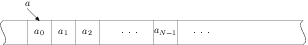

# Զանգվածներ եւ կրկնություններ

Ստրուկտուրաները հնարավորություն են տալիս սահմանելու տարբեր տիպերի դաշտեր
ունեցող բաղադրյալ օբյեկտներ։ Հաճախ նաև պետք է լինում սահմանել տարրերի
նույն տիպն ունեցող բաղադրյալ օբյեկտներ՝ զանգվածներ։ Այս զրույցը C լեզվի
զանգվածների և հաշվիչով ցիկլի մասին է։

*Զանգվածը* նույն անունն ունեցող միատեսակ տարրերի անընդհատ շարք է։ Դրա մի
որևէ տարրին կարելի է դիմել _ինդեքսավորման_ գործողությամբ, զրոյից սկսվող
ինդեքսի միջոցով։ Օրինակ, եթե -ն տարրեր ունեցող զանգված է, ապա նրա առաջին
տարրին կարելի է դիմել `a[0]` գրառմամբ, իսկ վերջին տարրին՝ `a[N-1]`
գրառմամբ։ Սի լեզվում որևէ տիպի օբյեկտների զանգվածը հայտարավում է
փոփոխականի անունից հետո `[` և `]` փակագծերում տարրերի քանակը նշելով։

\

Օրինակ, առանց նշանի ամբողջ թվերի տաս տարրերից բաղկացած զանգված կարող ենք
սահմանել հետևյալ հրամանով.

    unsigned int v0[10];

Զանգվածը հայտարարելիս կարելի է միանգամից արժեքավորել նրա տարրերը։
Օրինակ.

    int v1[5] = { 1, 2, 3, 4, 5 };

Այս հրամանով սահմանված է հինգ ամբողջ թվերի զանգված, և տարրերն
արժեքավորված են $1..5$ միջակայքի թվերով։

Համանման ձևով են սահմանվում նաև բազմաչափ զանգվածները։ Օրինակ,
$2\times 3$ չափի մատրիցը կարելի է սահմանել ու արժեքավորել այսպես.

    double m0[2][3] = { {1.1, 1.2, 1.3}, {2.2, 2.3, 2.4} };

Եթե զանգվածը սահմանելիս արժեքավորման ցուցակում տրված են ավելի քիչ
արժեքներ, քան զանգվածի չափն է, ապա պակասող արժեքների փոխարեն զանգվածում
գրվում են զրոներ։ Օրինակ, հետևյալ սահմանումից հետո եթե վերցնեմ զանգվածի
հինգերորդ տարրը, ապա կտեսնեմ, որ այն զրո է։

    long double v2[10] = { 1.2, 2.3 };

Պակասող տարրերը զրոներով արժեքավորելու հատկությունը օգտակար է
զանգվածներին սկզբնական արժեքներ տալիս։ Անորոշություններից խուսափելու
համար միշտ խորհուրդ է տրվում նոր սահմանվող զանգվածը արժեքավորել `{ 0 }`
արտահայտությամբ։ Ահա այսպես.

    unsigned int v3[128] = { 0 };

Սի լեզվում զանգվածի անունը _ցուցիչ_ է իր առաջին տարրին, իսկ զանգվածի
տարրերին կարելի է դիմել ոչ միայն `[]` գործողությամբ, այլ նաև ցուցիչների
հետ թվաբանական գործողություններ կատարելով։ Օրինակ, զանգվածի երրորդ տարրն
արտածելու համար կարող ենք գրել հետևյալ երկու համարժեք հրամանները.

    printf( "%d\n", v1[2] );
    printf( "%d\n", *(v1 + 2) );

Զանգվածների հետ աշխատանքը ցուցադրելու համար ուզում եմ բերել մի օրինակ՝
նորից օգտագործելով դեկարտյան կետը։ Ենթադրենք դեկարտյան կետերի զանգվածը
պարունակում է հարթության վրա ցրված հատ կետեր։ Պետք է գրել մի ֆունկցիա,
որը վերադարձնում է տրված կետերը որպես գագաթներ ունեցող բեկյալի
երկարությունը։

Հիշեցնեմ ստրուկտուրայի հայտարարությունը.

    struct point {
      double x;
      double y;
    };

Բեկյալի երկարությունը նրա հանգույցների երկարությունների գումարն է։ Ամեն
մի հանգույցի երկարությունը նրա ծայրակետերի հեռավորությունն է, որը
հաշվում եմ Պյութագորասի բանաձևով։

    double distance( struct point a, struct point b )
    {
      double dx = a.x - b.x;
      double dy = a.y - b.y;
      return sqrt( dx _ dx + dy _ dy );
    }

Բեկյալի երկարությունը հաշվող ֆունկցիան կարող է ունենալ հետևյալ
հայտարարությունը.

    double length( const struct point[], int );

Սա նշանակում է, որ անունով ֆունկցիան արգումենտում սպասում է
`struct point` օբյեկտների զանգված և մի ամբողջ թիվ, որը զանգվածի տարրերի
քանակն է։ Ֆունկցիայի վերադարձրած արժեքն էլ բեկյալի երկարությունն է։
ծառայողական բառը ցույց է տալիս, որ զանգվածը ֆունկցիային է փոխանցվել
որպես *հաստատուն*. նրա արժեքները կարելի է միայն կարդալ (read-only), բայց
չի կարելի փոփոխել։

Ի դեպ, քանի որ զանգվածի անունն իր առաջին տարրի ցուցիչն է, վերը բերված
հայտարարությունը կարող է ունենալ նաև հետևյալ համարժեք տեսքը.

    double length( const struct point*, int );

$N$ գագաթներ ($N-1$ հանգույցներ) ունեցող բեկյալի երկարությունը ես
կհաշվեմ ռեկուրսիվ եղանակով՝ ըստ գագաթների քանակի։ Եթե զանգվածում մեկ
տարր է, ապա բեկյալը հանգույցներ չունի և նրա երկարությունը զրո է։ Եթե
բեկյալն ունի $n$ գագաթներ, ապա նրա երկարությունը հավասար է $n-1$-րդ և
$n$-րդ գագաթների հեռավորությանը գումարած առաջին $n-1$ գագաթներից կազմված
բեկյալի երկարությունը։

    double length( const struct point ps[], int nm )
    {
      if( nm == 1 )
        return 0.0;
      return distance( ps[nm-1], ps[nm-2] )
           + length( ps, nm-1 );
    }

Կարծես թե ճիշտ է, բայց ստուգելը չի խանգարի։ Սահմանեմ մի վեկտոր, որը
պարունակում է $f(x)=x$ ուղղին պատկանող $(0,0)$, $(1,1)$, $(2,2)$ և
$(3,3)$ կետերը, ապա հաշվեմ ու արտածեմ այդ կետերով կազմված բեկյալի (ուղիղ
գծի) երկարությունը։

    int main()
    {
      struct point ps[] = { {0,0}, {1,1}, {2,2}, {3,3} };
      double res = length( ps, 4 );
      printf( ">> %lf\n", res );
      return 0;
    }

զանգվածը սահմանելիս ես նրա չափը բացահայտ չեմ նշել։ Եթե առկա է զանգվածն
արժեքավորող ցուցակ, ապա կոմպիլյատորը զանգվածի չափը պարզում է այդ
ցուցակում տրված արժեքների քանակով։ Տվյալ դեպքում թվարկված են չորս կետի
կոորդինատներ, հետևաբար զանգվածի չափը $4$ է։

Զանգվածի տարրերին հաջորդաբար դիմելու ամենահարմար միջոցը Սի լեզվի կրկնման
հրամանն է։ Այս հրամանը հիմնականում օգտագործվում է *հաշվիչով
կրկնություններ* կազմակերպելու համար։

    for( ⟨հաշվիչի արժեքավորում⟩; ⟨կրկնման պայման⟩; ⟨հաշվիչի փոփոխում⟩ )
      ⟨կատարվող մարմին⟩

Նախ՝ հաշվարկվում է արտահայտությունը, որով սահմանվում և սկզբնական արժեք է
ստանում ցիկլի հաշվիչը։ Այնուհետև, քանի դեռ _կեղծ է_ արտահայտության
արժեքը, կատարվում են ցիկլի բլոկի հրամանները։ Ցիկլի մարմնի հրամանների
կատարումից հետո հաշվարկվում է արտահայտությունը, որը նախատեսված է ցիկլի
հաշվիչը ինչ-որ կանոնով փոփոխելու (ավելացնելու կամ պակասեցնելու) համար։

Օրինակ, եթե պետք լինի գտնել իրական թվերի զանգվածի ամենամեծ տարրը, ապա
կարող եմ գրել հետևյալ ֆունկցիան.

    double amax( const double arr[], int num )
    {
      double max = arr[0];
      for( int k = 1; k < num; ++k )
        if( max < arr[k] )
          max = arr[k];
      return max;
    }

ֆունկցիայի հրամանում `int k = 1` արտահայտությամբ սահմանվել է հաշվիչը և
նրան տրվել է $1$ սկզբնական արժեքը։ Այդ հրամանում որպես ցիկլի ավարտի
պայման է նշված `k < num` արտահայտությունը։ Սա նշանակում է, որ ցիկլը
կկատարվի այնքան անգամ, քանի դեռ -ն փոքր է -ից։ Նույն հրամանում հաշվիչը
փոփոխվում է `++k` արտահայտությամբ, որը ցիկլի ամեն մի իտերացիայից հետո -ի
արժեքն ավելացնում է մեկով։

Արժեքի _ավելացման_ `++` (increment) գործողությունը Սի լեզվում հանդես է
գալիս _նախածանցային_ (prefix) և _վերջածանցային_ (postfix) տեսքերով։
Օրինակ, կարելի է գրել և՛ `++k`, և՛ `k++`։ Առաջին դեպքում արտահայտության
արժեքը -ի նոր արժեքն է, իսկ երկրորդ դեպքում՝ հինը։ Օրինակ, կարող եմ
սահմանել և ֆունկցիաները, որոնցից առաջինը համարժեք է `++` գործողության
նախածանցային տարբերակին, իսկ երկրորդը՝ վերջածանցային տարբերակին։

    /* նախածանցային ինկրեմենտի մոդելը */
    int inc_pr( int* var )
    {
      *var = *var + 1;
      return var;
    }

    /* վերջածանցային ինկրեմենտի մոդելը */
    int inc_po( int* var )
    {
      int old = *var;
      *var = *var + 1;
      return old;
    }

`++` գործողության նմանությամբ C լեզուն տրամադրում է նաև արժեքի
*նվազեցման* `--` (decrement) գործողությունը։ Սա նույնպես հանդես է գալիս
նախածանցային ու վերջածանցային տարբերակներով։

Բեկյալի երկարությունը հաշվող _length_ ֆունկցիան, որ սահմանեցի վերևում,
նույնպես կարող եմ գրել ցիկլի օգնությամբ։ \[Բայց պիտի ասեմ, որ ռեկուրսիվ
իրականացումն ինձ ավելի _գեղեցիկ_ է թվում։\]

    double length( struct point ps[], int nm )
    {
      double result = 0.0;
      for( int j = 1; j < nm; ++j )
        result += distance( ps[j-1], ps[j] ) ;
      return result;
    }

Այս ֆունկցիայի հրամանի մարմնում օգտագործված `+=` գործողությունն իր աջ
կողմում գրված արտահայտության արժեքը ավելացնում է ձախ կողմում գրված
փոփոխականին։ Ավելի պարզ ասած՝  `+=`  արտահայտությունը համարժեք է
 `=` `+`  արտահայտությանը։ Նույն տիպի «կրճատ» վերագրման տարբերակներ կան
նաև հանման՝ `-=`, բազմապատկման՝ `*=`, բաժանման՝ `/=` և այլ
գործողությունների համար։

Եվս մի օրինակ, ու վերջացնեմ զանգվածների մասին զրույցը։ Գրեմ մի ֆունկցիա,
որը տրված իրական թվերի միաչափ զանգվածի տարրերը դասավորում է հակառակ
կարգով։

    void areverse( double arr[], int nm )
    {
      for( int b = 0, e = nm - 1; b < e; ++b, --e ) {
        double temp = arr[b];
        arr[b] = arr[e];
        arr[e] = temp;
      }
    }

հրամանում սահմանվել են երկու հաշվիչներ՝ , որը «շարժվում» է զանգվածի
սկզբից դեպի վերջը, և , որը «շարժվում» է վերջից դեպի սկիզբը։ Ցիկլը
կատարվում է այնքան անգամ, քանի դեռ զանգվածի ինդեքսը փոքր է ինդեքսից։
Ցիկլի ամեն մի իտերացիայից հետո ինդեքսն աճում է, իսկ -ն՝ նվազում։
`++b, --c` արտահայտության մեջ նույնպես օգտագործված է `,` (ստորակետ)
*թվարկման* գործողությունը։ Դե իսկ ցիկլի մարմնում, որն այս դեպքում
բաղկացած է երեք հրամաններից, կատարվում է արժեքների տեղափոխությունը՝ -րդ
տարրը գրվում -րդի փոխարեն և հակառակը։ Հենց այն պատճառով, որ հրամանի
մարմնում մի քանի հրամաններ են, մարմինը վերցրած է `{` նիշով սկսվող և `}`
նիշով ավարտվող _բլոկի_ մեջ։ Պետք է նշել, որ բլոկում սահմանված փոփոխականը
*լոկալ* է՝ տեսանելի է միայն բլոկի մարմնում։

Ես ուզում էի այս օրինակով ավարտել զանգվածների ու պարամետրով ցիկլի մասին
զրույցը, բայց խոսքը խոսք բերեց ու ես որոշեցի գրել ֆունկցիայի մի այլ
տարբերակ։ ֆունկցիայում, զանգվածի տարրերին դիմելիս, ինդեքսների փոխարեն
օգտագործում եմ ցուցիչներ։

    void areversep( double* arr, int nm )
    {
      for( double *p = arr, *q = arr + nm - 1; p < q; ++p, --q ) {
        double temp = *p;
        *p = *q;
        *q = temp;
      }
    }

Արդեն ասել եմ, որ Սի լեզվի կոմպիլյատորը զանգվածի անունը համարում է
ցուցիչ նրա առաջին տարրին։ Դա հաշվի առնելով ֆունկցիայի պարամետրը
նկարագրել եմ որպես `double*`։ Այնուհետև՝ հրամանի հաշվիչները սահմանում եմ
ոչ թե որպես զանգվածի ինդեքսներ, այլ որպես նրա տարրերի ցուցիչներ. -ն
ստանում է նույն սկզբնական արժեքը, իսկ -ն՝ `arr + nm - 1` արժեքը, որը
զանգվածի վերջին տարրի հասցեն է։ Ցիկլը կատարվում է, քանի դեռ հասցեն փոքր
է հասցեից։ Սի լեզվում երկու ցուցիչների համեմատությունն իմաստալից է միայն
այն դեպքում, եթե դրանք ցույց են տալիս միևնույն զանգվածի տարրերին։ `++` և
`--` գործողությունները նույնպես թույլատրելի են ցուցիչների նկատմամբ։
`++`-ը ցուցիչը տեղափոխում է իրեն հաջորդող տարրին, իսկ `--`-ը՝ իրեն
նախորդող տարրին։
