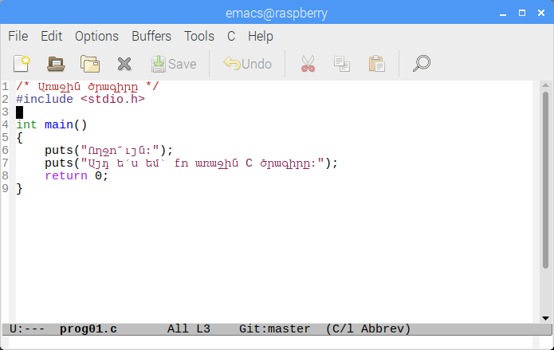

# Բան Ա․ Առաջին ծրագիրը

> _Սի լեզվով գրված առաջին ծրագիրը, դրա խմբագրումը, թարգմանումը և կատարումը։_

Մի հայտնի ու իմաստուն գրքում (K&R) ասվում է, որ ծրագրավորման լեզուն սովորելու ամենալավ եղանակը դրանով ծրագրեր գրելն է։ Ես հետևում եմ այդ խորհրդին ու Սի լեզվի մասին առաջին իմ _զրույցը_ սկսում եմ մի կարճ ծրագրով։ Այն պետք է արտածման ստանդարտ հոսքին դուրս բերի երկու տող՝ «Ողջո՜ւյն։» և «Այդ ե՛ս եմ՝ քո առաջին Սի ծրագիրը։»։

Բայց... եկեք չշտապենք ու նախ տեսնենք, թե ինչ «կյանք է ապրում» ծրագիրը մտահաղացումից մինչև իրականացում ու կատարում։

Եվ այսպես. պետք է Սի լեզվով գրենք ծրագիր, որն արտածում է տեքստի երկու տող. սա մտահաղացումն է։


```c
/* Առաջին ծրագիրը */
#include <stdio.h>

int main()
{
    puts("Ողջո՜ւյն։");
    puts("Այդ ե՛ս եմ՝ քո առաջին Սի ծրագիրը։");
    return 0;
}
```

Առաջին տողում գրված `/*` նիշերով սկսվող և `*/` նիշերով ավարտվող տեքստը _մեկնաբանություն_ է։ Մեկնաբանությունները նախատեսված են մարդկանց համար․ դրանք ամբողջությամբ անտեսվում են կոմպիլյատորի կողմից։ Սի լեզվում մեկնաբանություններ կարելի է գրել նաև C++ լեզվից փոխանցված եղանակով. այդպիսի մեկնաբանությունները սկսվում են `//` նիշերով և տարածվում են մինչև տողի վերջը։

Երկրորդ տողի `#include <stdio.h>` արտահայտությունը պահանջում է կոմպիլյացիայից առաջ `prog01.c` ֆայլին կցել գրադարանային `stdio.h` ֆայլը։ Այն պարունակում է տվյալների ներմուծման ու արտածման համար նախատեսված ստանդարտ ֆունկցիաների, կառուցվածքների և այլ ծրագրային բաղադրիչների հայտարարությունները։ Առաջ անցնելով նշենք, որ `#` նիշով սկսվող բոլոր հրահանգները նախատեսված են _նախապրոցեսորի_ (_preprocessor_) համար, և Սի լեզվի մաս չեն կազմում. այս մասին քիչ ավելի ուշ։

Չորրորդ տողում գրված է Սի ծրագրերի _մուտքի կետ_՝ կատարման սկիզբ, հանդիսացող `main` ֆունկցիայի վերնագիրը։ Տվյալ դեպքում `main` ֆունկցիան արգումենտներ չի սպասում՝ նրա արգումենտների ցուցակը դատարկ է, բայց վերադարձնում է `int` (integer, ամբողջ թիվ) տիպի արժեք։ Սի լեզվով գրված բոլոր ծրագրերն իրենց աշխատանքը սկսում են հենց `main` ֆունկցիայից։ Ավելի պատկերավոր ասած՝ `main` ֆունկցիան կանչվում է օպերացիոն համակարգի կողմից, իսկ նրա վերադարձրած արժեքը օպերացիոն համակարգը մեկնաբանում է որպես կատարվող ծրագրի հաջող կամ անհաջող ավարտի հայտանիշ։ Պայմանավորվածություն կա, որ `0` արժեք են վերադարձնում հաջող ավարտված ծրագրերը, իսկ զրոյից տարբեր արժեք՝ անհաջող ավարտվածները։

Սի ֆունկցիայի _մարմինը_՝ այն հրամանների հաջորդականությունը, որոնցով որոշվում է ֆունկցիայի վարքը, պարփակված է ֆունկցիայի վերնագրին հաջորդող `{` և `}` փակագծերի մեջ։ Մեր օրինակի հինգերորդ տողում սկսվում է և իներորդ տողում ավարտվում է `main` ֆունկցիայի մարմինը։

Վեցերորդ և յոթերորդ տողերում օգտագործված է `stdio` (standard input-output) գրադարանի `puts` (put string — արտածել տողը) ֆունկցիան։ Այն իր արգումենտում ստանում է նիշերի տող և այդ տողն արտածում է `stdout` արտածման ստանդարտ հոսքին։

Ութերորդ տողում օգտագործված `return` հրամանը նախատեսված է ֆունկցիայից արժեք վերադարձնելու համար (սրա մասին դեռ շատ կխոսենք)։ Այստեղ `return` հրամանով `main` ֆունկցիան վերադարձնում է `0` արժեքը, որը, ինչպես արդեն նշեցինք, ցուց է տալիս ծրագրի՝ այդ կետում հաջող ավարտված լինելը։

Վերջապես նկատենք նաև, որ բոլոր հրամաններն ավարտվում են `;` (կետ-ստորակետ) նիշով։

Հիմա փորձենք «կյանք տալ» այս ծրագրին. այսինքն՝ թարգմանել այն մեքենայական լեզվի ու կատարել։ Դրա համար տեսնենք թե ինչ կյանք է ապրում ծրագիրը՝ մտահաղացումից մինչև կատարում։

Ժամանակակից ծրագրավորողը քոմփյութերային ծրագրերի մշակման ընթացքում կատարում է հետևյալ հիմնական քայլերը․

_Ծրագրի տեքստի խմբագրում_ (editing) ― մի որևէ տեքստային խմբագրիչով, կամ ծրագրերի մշակման ինտեգրացված միջավայրում (IDE, integrated development environment) ստեղծվում է ծրագրի տեքստը և պահպանվում է ֆայլի մեջ։ Սի լեզվով գրված ծրագրերի ֆայլերը հիմնականում ունենում են `.c` վերջավորություն, իսկ հայտարարությունների ֆայլերը՝ `.h` վերջավորություն։

Տվյալ դեպքում տեքստային խմբագրիչում ներմուծում եմ վերը բերված ծրագրի տեքստը և այն պահպանում եմ `prog01.c` անունով ֆայլում։



_Թարգմանություն_ կամ _կոմպիլյացիա_ (compilation) ― թարգմանող ծրագրի՝ _կոմպիլյատորի_ միջոցով ծրագրի տեքստային ներկայացումից կառուցվում է կոնկտրետ սարքակազմի վրա և կոնկրետ օպերացիոն համակարգում աշխատող, մեքենայական կոդը պարունակող _կատարվող մոդուլը_ (executable module)։

Ծրագրի `prog01.c` ֆայլը (source file) թարգմանում եմ այսպես.

```bash
$ cc prog01.c -o prog01
```

Այս հրամանում կոմպիլյատորին տրվող `-o` պարամետրի արգումենտով որոշվում է ստեղծվելիք կատարվող մոդուլի անունը։ `-o` պարամետրի բացակայության դեպքում կոմպիլյատորը կստեղծի `a.out` անունով կատարվող ֆայլ։ Եթե ծրագրի տեքստը սխալներ չի պարունակում, և կոմպիլյացիան հաջող է անցնում, ապա ստեղծվում է `prog01` կատարվող մոդուլը։

_Թեսթավորում_ (testing) և _կատարում_ (execution) ― օպերացիոն համակարգը կատարվող մոդուլը բեռնում է մեքենայի հիշողության մեջ և սկսում է կատարել այն։ Ինչպես արդեն նշվեց վերեւում, կատարումը սկսվում է `main` ֆունկցիայից։ Թեսթավորման ժամանակ ծրագիրը կատարվում է նախապես որոշված տվյալներով ու սցենարներով և դրա ստեղծած արդյունքները համեմատվում են ակնկալվող արդյունքների հետ։ Կատարման ժամանակ ծրագիրը պարզապես շահագործվում է ըստ իր նշանակության։

`prog01` մոդուլն աշխատեցնելու համար պարզապես պետք է Bash-ի հրամանային տողից այն գործարկել ինչպես որևէ այլ ծրագիր.

```bash
$ ./prog01
Ողջո՜ւյն։
Այդ ե՛ս եմ՝ քո առաջին C ծրագիրը։
```

Հիմա, եթե `echo` հրամանով արտածենք Bash-ի `$?` փսոևդոփոփոխականը, որը պարունակում է վերջին աշխատած ծրագիր ավարտի կոդը, ապա կստանանք `0` արժեքը։ Այս `0`-ն հենց `main` ֆունկցիայից `return` հրամանով վերադարձրած արժեքն է։

```bash
$ echo $?
0
```

Համոզվելու համար կարող ենք, օրինակ, `return 0;` հրամանը ծրագրում փոխարինել, `return 7;` հրամանով, ապա կատարելուց հետո նորից ստուգել `$?`-ի արժեքը։

_Շտկում_ (debugging) ― եթե կոմպիլյացիայի, թեսթավորման կամ կատարման քայլերում ծրագրում հայտնաբերվել են բառային (լեքսիկական), շարահյուսական կամ տրամաբանական սխալներ,  ապա շտկումներ են կատարվում ծրագրի տեքստում և կոմպիլյացիայի, կատարման կամ թեսթավորման քայլերը նորից կրկնվում են անհրաժեշտ հաջորդականությամբ։

Այս պարզագույն օրինակում, իհարկե, դժվար է ինչ-որ մի տեխնիկական սխալ անել։ Բայց ենթադրենք, թե մոռացել ենք 6-րդ տողն ավարտող `;` նիշը։ Կոմպիլյատորը կհայտնաբերի սխալը և կարտածի համապատասխան հաղորդագրություն.

````text
prog01.c: In function ‘main’:
   prog01.c:7:4: error: expected ‘;’ before ‘puts’
   puts("Այդ ե՛ս եմ՝ քո առաջին C ծրագիրը։");
   ^~~~
````

Այս հաղորդագրությունը՝ `prog01.c:7:4: error: expected ‘;’ before ‘puts’`, ասում է, որ `prog01.c` ֆայլի 7-րդ տողի 4-րդ դիրքի մոտ՝ `puts` բառից առաջ սպասվում է `;` նիշը։
