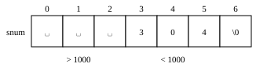

# Տեքստի տողեր {#cha:strings}

> Այս զրույցը տողերի մասին է։ Նախ՝ համառոտ կպատմեմ տողերի ներկայացման և
> դրանց հետ առավել հաճախ կատարվող գործողությունների մասին, ապա մի
> ամբողջական օրինակով կցուցադրեմ այդ նկարագրված հնարավորությունների
> օգտագործումը։

Սի լեզվում *տողը* նիշերի (character) միաչափ զանգված է, որի վերջին տարրն
անպայման պետք է `0` արժեքը (կամ `\0` նիշը) լինի։ Տողի՝ `\0` նիշով
ավարտվելու հատկությունն ակտիվորեն օգտագործվում է տողերի հետ աշխատող
ֆունկցիաներում։ Օրինակ, տողի երկարությունը հաշվելու համար բավական է
հաշվել տողի սկզբից մինչև առաջին `\0` նիշն ընկած նիշերի քանակը։ Ասենք,
եթե `string.h` գրադարանում արդեն սահմանված չլիներ ֆունկցիան, ապա սկսնակ
ու անփորձ ծրագրավորողը կարող էր այն իրականացնել մոտավորապես հետևյալ
կերպ.

    int strlen0( char* str )
    {
      int count = 0;               /* նիշերի քանակի հաշվիչ */
      while( str[count] != '\0' )  /* քանի դեռ նիշը \0 չէ */
        ++count;                   /* ավելացնել հաշվիչը */
      return count;
    }

Ավելի փորձառու ծրագրավորողը նույնպես կօգտագործի `\0` նիշի առկայությունը,
բայց կօգտագործի ցուցիչների հետ կատարվող թվաբանություն։

    size_t strlen1( const char* s )
    {
      const char* p = s;      /* սկսել ցուցակի սկզբից */
      while( *++p != '\0' );  /* քանի դեռ p-ն \0 նիշի վրա չէ, առաջ տանել այն */
      return p - s;           /* վերադարձնել երկու ցուցիչների տարբերությունը */
    }

Օգտագործված տիպը նախատեսված է օբյեկտների չափը ցույց տվող փոփոխականներ
սահմանելու համար։ Նրա արժեքը առանց նշանի ամբողջ թիվ է։

Մեկ ուրիշն էլ տողի՝ `'\0'` նիշով ավարտվելու հատկությունը կօգտագործի
որպես ռեկուրսիայի ավարտի հայտանիշ ու կգրի հետևյալը.

    size_t strlen2( const char* s )
    {
      if( '\0' == *s ) return 0;
      return 1 + strlen2(s + 1);
    }

Հիմա տեսնենք, թե ինչպես են սահմանվում ու արժեքավորվում տողերը։ Դե, քանի
որ տողը նիշերի զանգված է, ապա «`String`» տողը պարունակող փոփոխականի
սահմանումը կարող է ունենալ հետևյալ տեսքը.

    char h0[] = { 'S', 't', 'r', 'i', 'n', 'g', '\0' };

Սի լեզվում տողային հաստատունը ներկայանում է `"` չակերտների մեջ վերցրած
նիշերի հաջորդականությամբ և կոմպիլյատորը թույլ է տալիս նիշերի զանգվածն
արժեքավորել հանց այդ տիպի հաստատուններով։ Այսինքն, վերը բերված
սահմանմանն է համարժեք հետևյալը.

    char h1[] = "String";

Այս դեպքում տողն ավարտող `'\0'` նիշը բացահայտ տրված չէ, բայց
կոմպիլյատորը միշտ ավելացնում է այն։

Այնուհետև, քանի որ զանգվածի անունը ցուցիչ է իր առաջին տարրին, կարող եմ
գրել նաև այսպիսի սահմանում.

    char* h3 = "String";

Երբ տողի սահմանման ժամանակ չափը բացահայտ տրվում է, ապա պետք է տեղ
նախատեսել նաև տողի վերջի `'\0'` նիշի համար։ Օրինակ, եթե «`String`» տողի
երկարությունը 6 է, ապա պետք է գրել.

    char h2[7] = "String";

Եթե և փոփոխականները հայտարարված են որպես տողեր (նույնն է թե նիշերի
զանգվածներ կամ նիշերի ցուցիչներ), ապա պարզ է, որ -ի արժեքը -ին
վերագրելու համար արտահայտությունը բավարար չէ։ Այս դեպքում ցուցիչին
կվերագրվի ցուցիչի արժեքը և այդ երկուսն էլ ցույց կտան հիշողության
միևնույն տիրույթին։

Տողերի վերագրման կամ, ավելի ճիշտ ասած՝ *պատճենման*, համար նախատեսված են
գրադարանային և ֆունկցիաները։ ֆունկցիան իր երկրորդ արգումենտի
պարունակությունը պատճենում է առաջինի մեջ (պատճենելով նաև տողն ավարտող
`'\0'` նիշը)։ Օրինակ.

    char* h4 = "One string";
    char h5[11] = { 0 };
    strcpy( h5, h4 );
    puts( h5 ); /* արտածվում է One string */

Տողեր պատճենող ֆունկցիան իր աճաջին արգումենտի մեջ է պատճենում երկրորդ
արգումենտում տրված տողի նշված քանակով նիշեր։ Պատճենվող նիշերի քանակը
տրվում է ֆունկցիայի երրորդ արգումենտով։ Օրինակ, այսպես.

    char* h6 = "0123456789";
    char h7[11] = { 0 };
    strncpy( h7, h6, 5 );
    puts( h7 ); /* արտածվում է 01234 */

Եթե պետք է մի տողին *կցել* մեկ այլ տողի պարունակություն, ապա
օգտագործվում են և ֆունկցիաները։ Առաջինը կցում է ամբողջ տողը, իսկ
երկրորդը՝ միայն տրված քանակով նիշեր։ Օրինակ.

    char s4[64] = { 0 };
    strcpy( s4, "One" );
    puts( s4 ); /* արտածվում է One */
    strcat( s4, ", Two" );
    puts( s4 ); /* արտածվում է One, Two */
    strncat( s4, ", Three, Four", 7 );
    puts( s4 ); /* արտածվում է One, Two, Three */

Տողերը *համեմատվում* են ֆունկցիայով։ Այս ֆունցկիան կատարում է
արգումենտում տրված երկու տողերի *բառարանային* համեմատում։ Եթե երկու
տողերի պարունակությունը համընկնում է ֆունկցիան վերադարձնում է $0$։ Եթե
առաջինի արժեքը բառարանային կարգով ավելի փոքր է երկրորդի արժեքից, ապա
վերադարձվում է բացասական արժեք, իսկ եթե մեծ է՝ դրական արժեք։ ֆունկցիայի
երրորդ արգումենտով նշվում է, թե երկու տողերի սկզբից քանի նիշ պետք է
համեմատել։

ֆունկցիան իր առաջին արգումենտում տրված տողում որոնում է երկրորդ
արգումենտում տրված նիշը։ Այս ֆունկցիան վերդարձնում է գտնված նիշի
ցուցիչը, կամ ՝ եթե այդպիսին չի գտնվել։ Օրինակ.

    char* s0 = "One String";
    char* s1 = strchr( s0, 'S' );
    puts( s1 ); /* արտածում է String */

Տողի մեջ մի այլ տող որոնելու համար է նախատեսված ֆունկցիան։ Այն իր առաջին
արգումենտում տրված տողի մեջ որոնում է երկրորդ արգումետում տրված
ենթատողը։ ֆունկցիան վերադարձնում է գտնված ենթատողի առաջին նիշի ցուցիչը,
կամ ՝ եթե ենթատողը չի գտնվել։ Օրինակ.

    char* s2 = "One long string";
    char* s3 = strstr( s2, "long" );
    puts( s3 ); /* արտածում է long string */

\* \* \*

Տողերի հետ աշխատող ֆունկցիաները ցուցադրելու համար ներկայացնեմ բավականին
հայտնի մի խնդիր։ Տրված է $1..999999$ միջակայքի մի դրական ամբողջ թիվ և
պահանջվում է կառուցել նրա բառային արտահայտությունը։ Օրինակ, եթե տրված է
$428$, ապա պետք է կառուցել «չորս հարյուր քսանութ» տողը։ Այս խնդրի
լուծման ալգորիթմն այնքան պարզ է, որ նույնիսկ ամոթ էլ է դրան «ալգորիթմ»
ասել։

Եվ այսպես, թող որ թվի թվային տեսքից բառային տեսքը ստացող ֆունկցիան ունի
հետևյալ հայտարարությունը, առաջին արգումենտը թիվն է, իսկ երկրորդ
արգումենտն այն բուֆերն է, որտեղ պետք է գրվի պատասխանը։

    void number_as_words( int, char* );

Մի քիչ առաջ ընկնելով սահմանեմ ֆունկցիան տեստավորող ֆունկցիան, որը
ստանում է թիվ և այդ թվի սպասվող բառային տեսքը։

    void test_number_as_words( int number, const char* expected )
    {
      char result[128] = { 0 }; /* պատասխանի բուֆեր */
      number_as_words( number, result ); /* թարգմանություն */
      if( 0 != strcmp( result, expected ) )  /* համեմատում սպասվող արժեքի հետ */
        printf( "ՍԽԱԼ։ %d թվի համար\n սպասվում է '%s'\n  ստացվել է '%s'\n",
            number, expected, result );
    }

Ունենալով և ֆունկցիաները, իմ ծրագրում պետք է կատարվեն հետևյալ
արտահայտությունները և ոչ մի սխալի հաղորդագրություն չպետք է արտածվի։

    test_number_as_words( 1, "մեկ" );
    test_number_as_words( 9, "ինն" );
    test_number_as_words( 11, "տասնմեկ" );
    test_number_as_words( 96, "ինսունվեց" );
    test_number_as_words( 964, "ինն հարյուր վաթսունչորս" );
    test_number_as_words( 9610, "ինն հազար վեց հարյուր տաս" );
    test_number_as_words( 24531, "քսանչորս հազար հինգ հարյուր երեսունմեկ" );
    test_number_as_words( 110310, "մեկ հարյուր տաս հազար երեք հարյուր տաս" );

Հիմա հենց ֆունկցիայի մասին։ Նախ սահմանեմ երկու գլոբալ ստատիկ զանգվածներ,
որոնք օգտագործվելու են ֆունկցիայի մեջ։ Դրանցից առաջինը պարունակում է
միանիշ թվերի անունները (բացի զրոյից, որովհետև նրա անունը պետք չի գալիս),
իսկ երկրորդը պարունակում է տասնավորների անունները։

    static const char* ones[] = {
      "", "մեկ", "երկու", "երեք", "չորս",
      "հինգ", "վեց", "յոթ", "ութ", "ինն" };

    static const char* tens[] = {
      "", "տաս", "քսան", "երեսուն", "քառասուն", "հիսուն",
      "վաթսուն", "յոթանասուն", "ութսուն", "ինսուն" };

Նաև սահմանեմ մակրոսը, որը պետք է օգտագործեմ թվանշանի նիշային (char)
տեսքից նրա տասական արժեքը ստանալու համար։ ASCII աղյուսակում թվանշաները
դասավորված են հերթականորեն՝ `0`, `1`,\..., `9`։ Իսկ Սի լեզվում նիշերի
հետ թվաբանական գործողություններ կատարելիս օգտագործվում են դրանց ASCII
կոդերը։ Հետևաբար, թվանշանի թվային արժեքը ստանալու համար բավական է նրա
կոդից հանել `0` նիշի կոդը։

    #define ord(c) (c-'0')

Քանի որ ձևափոխությունը սահմանափակվելու է միայն $[1..999999]$ միջակայքի
թվերի համար, ֆունկցիայով ֆորմատավորում եմ տրված թիվը՝ հատկացնելով նրան 6
դիրք։

    void number_as_words( int num, char* wnum )
    {
      char snum[7] = { 0 };
      sprintf( snum, "%6d", num );

Այս հրամաննի կատարումից հետո, օրինակ, $304$ թիվը բուֆերում կունենա
`␣␣␣304\0` տեսքը։ (Այստեղ `␣` նիշն օգտագործել եմ *բացատ* նիշի դիրքերը
ցույց տալու համար։)

\

Հերթականորեն վերլուծում եմ բուֆերի $0$-ից $5$ ինդեքսով դիրքերը և տողին
եմ կցում համապատսխան արտահայտությունը։

Եթե `snum[0] != ' '`, ապա պետք է արտածել միավորի անունը և «հարյուր»
բառը։ Միավորի անունը վերցնում եմ վեկտորից՝ արպես ինդեքս օգտագործելով
`snum[0]` թվանշանի թվային արժեքը։

      if( snum[0] != ' ' ) {
        strcpy( wnum, ones[ord(snum[0])] );
        strcat( wnum, " հարյուր " );
      }

Եթե `snum[1] != ' '`, ապա պետք է արտածել համապատասխան տասնյակի անունը՝
միայն «տաս» բառից հետո ավելացնելով «ն» տառը։

      if( snum[1] != ' ' ) {
        strcat( wnum, tens[ord(snum[1])] );
        if( snum[1] == '1' && snum[2] != '0' )
            strcat( wnum, "ն" );
      }

Եթե `snum[2] != ' '`, ապա պետք է արտածել միավորի անունը։

      if( snum[2] != ' ' )
        strcat( wnum, ones[ord(snum[2])] );

Այս կետում ավարտեցի թվի առաջին կեսի վերլուծությունը։ Հիմա պետք է ստուգել
արդյո՞ք վերլուծվող թիվը մեծ է հազարից։ Եթե այդպես է, ապա արտածել «հազար»
բառը' երկու կողմերից ավելացնելով բացատանիշեր։

      if( num >= 1000 )
        strcat( wnum, " հազար " );

Շարունակում եմ թվանշանների վերլուծությունը թվի երկրորդ կեսի համար, որը
ճիշտ նման է առաջին կեսի վերլուծությանը՝ այն տարբերությամբ միայն, որ
վեկտորի $0$, $1$ և $2$' ինդեքսների փոխարեն օգտագործվում են
համապատասխանաբար $3$, $4$ և $5$' ինդեքսները։

      if( snum[3] != ' ' ) {
        strcat( wnum, ones[ord(snum[3])] );
        if( snum[3] != '0' || num < 1000 )
          strcat( wnum, " հարյուր " );
      }

      if( snum[4] != ' ' ) {
        strcat( wnum, tens[ord(snum[4])] );
        if( snum[4] == '1' && snum[5] != '0' )
            strcat( wnum, "ն" );
      }

      if( snum[5] != ' ' )
        strcat( wnum, ones[ord(snum[5])] );
    }

Այսքանը։ Հիմա ֆունկցիան թվի թվանշանային տեքսից ստանում է նրա բառային
արտահայտությունը։ Բայց ակնհայտ է, որ այս ֆունկցիան ունի լավացնելու
տեղեր։ Մասնավորապես, կարելի է թվի առաջին ու երկրորդ կեսը թարգմանող
նույնական կոդը ձևակերպել որպես առանձին ֆունկցիա։ Թող դա էլ մնա որպես
վարժություն ընթերցողին։
